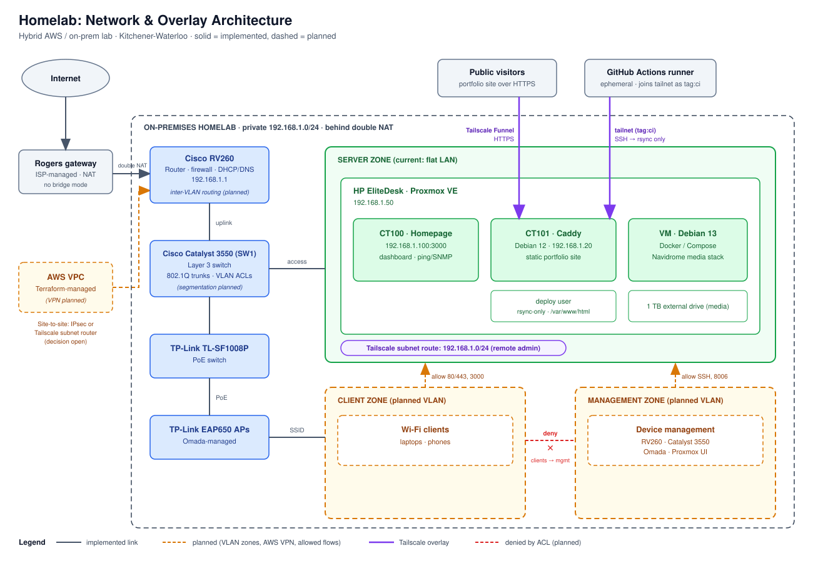

# Homelab

Configs, diagrams and write-ups for my home lab (Proxmox, Cisco RV260 and
Catalyst 3550, Tailscale). Secrets, public IPs and credentials are removed.

## What's here

| Path | Contents | Status |
|------|----------|--------|
| `docs/network-diagram.svg` | Network and overlay architecture | Implemented, VLAN zones planned |
| `docs/2026-09-deploy-pipeline.md` | Write-up: what broke building the deploy pipeline | Done |
| `ci/deploy.yml` | GitHub Actions deploy workflow (reference copy) | Implemented |
| `services/caddy/` | Caddy config for the portfolio site | Implemented |
| `services/tailscale/` | Funnel setup and CI access policy | Implemented |
| `scripts/rsync-wrapper.sh` | Restricts the deploy key to one rsync target | Implemented |
| `network/` | Sanitized RV260 and Catalyst 3550 configs | Coming soon |
